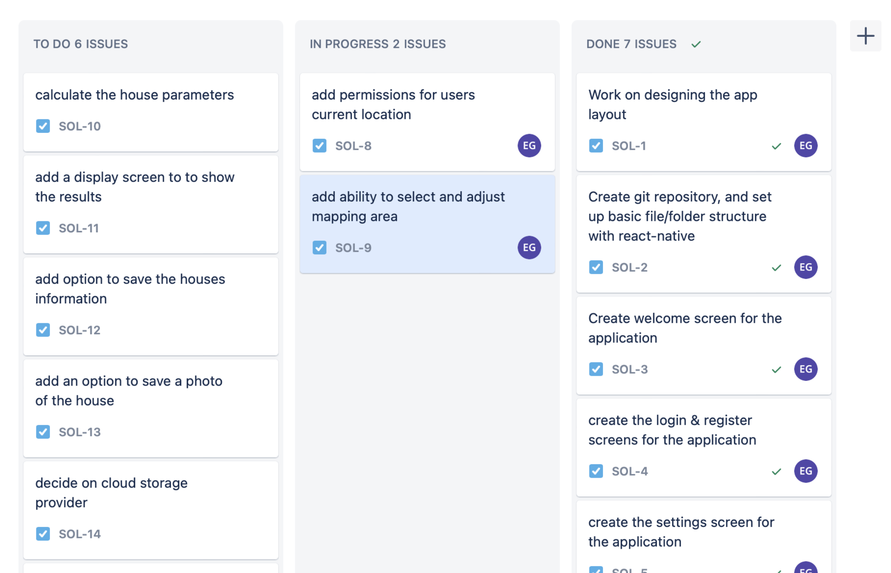
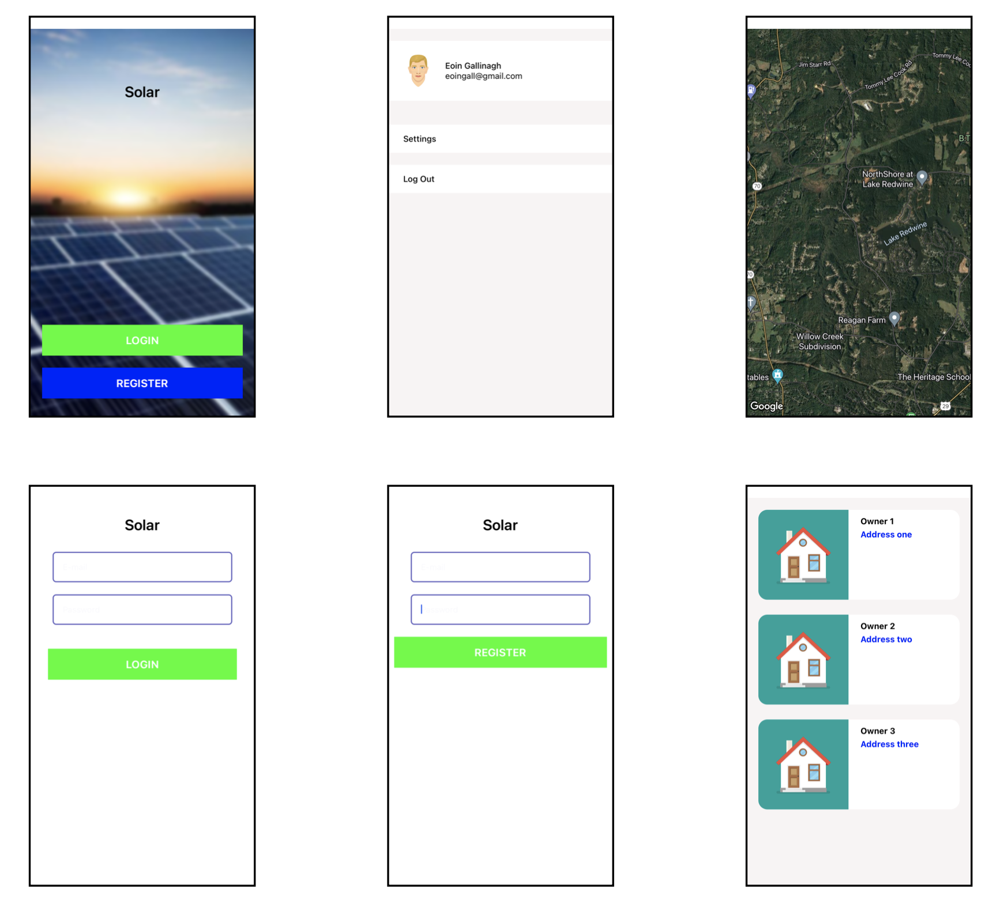

# Map for solar power potentials:

My final year project is a cross platform mobile application called “Solar” which will allow a users to select a house from a Map and calculate the solar power potential from the rooftop of the given house.

The goal of the project is to enable both individual users (searching their own properties) and solar panel advisors whom will be able to search and save multiple properties, to gather and analyse additional data about a houses solar power potentials before investing in applying solar panels to the rooftop.
I believe this convenient method of gathering a properties solar panel potentials could encourage more houses to invest in renewable energies leading to a reduction in emissions and energy costs within households.

To use the application, users will be able to simply, open the app and search for a specific address, or zoom in on a particular area of the map. The will then be able to select the desired property and view its solar potential, displayed in a easy to understand metric. The app will use information about the location, orientation, roof type, and house dimensions to calculate an estimate of the solar potentials.
This information aims to assist homeowners, potentials buyers, and solar panel advisers make informed decisions about investing in solar panels.

**Problems encountered and progress so far**

As I have progressed through the project so far, one of the main challenges I have faced has been deciding on indicators for accurately estimating the solar power potentials of a given property. I have found it difficult to strategically decide on the most beneficial indicators as well as balancing my own implementation abilities.
To get around this issue, I began designing a first level of the application, this means, I have focused on developing the application interface and various screens within the app, which will lead to my integration of maps within the application. I am first focused on working on the location of the property as well as the properties parameters and dimensions.
With this I will have a prototype of the application which I will later be able to implement additional layers of matrix upon.

Another key challenge in developing this application is making it user-friendly. This requires designing a clean an intuitive user interface which makes it easy for users to reach for a property, view its solar potential, and understand the results of the calculations.
So far with the project, I have decided to implement the application with react-native. This is a cross-platform mobile application development framework. The benefit of using “react-native” is that it will allow me to create a single application which will run on both android and iOS, with only a few permission changes within the source code for each. I have decided on using “Yarn” as my package manager, this will allow me to make use of additional packages throughout development, such a react-native-maps mapping functionality.
I have been using Jira to keep track of my tasks throughout my workflow. This is software I have previously used and found to be quite helpful. Jira allows me to work efficiently and plan out each of my development sessions in advance.

Alongside this, I have created a GitHub repository to store my project and have been using Git as my version control throughout. This has been an important measure throughout development.

In terms of the application development, I have created most of the primary screens, and have begun the implementation of mapping. Below I have attached screenshots of the applications Welcome Screen, Side-Panel/Settings Screen, Map Screen, Login Screen, Register Screen, and Saved Properties Screen.

\*\*\*\*This has been a challenging endeavour so far, however I am extremely delighted with the current progress.
Throughout the development, I have ensured to keep an reusable components separate from the screen, as so they may be reused on another screen. This includes each of the buttons, the colours, styling and display cards.

**Next steps**
My current application version is pulling property location and information from the Google Maps Api, I have also tested the Apple Maps Api, and Open Street Maps Api. I plan to do a full analysis of what information I will be able to obtain from each before deciding on the most beneficial api for my project.
I will then continue on calculating property information to determine estimates of solar power potentials. Once I am able to extract this information accurately, I will begin implementing navigations which will allow the movement between screen throughout the application as the screens are currently separated from each other.
Throughout the application navigation stages, I will implement user authentication and cloud storage. This will make use of any of the following: Google Cloud, Amazon Web Services, and/or FireBase. Although this will need further investigation to find the most suitable for my use case. My uses of this storage will be to allow users to save property information.
Once I have implemented the upcoming features, I will have a working version of the project, which I will then be able to make additional changes, aimed at improving the overall accuracy through the use of metrics such as property orientation, rooftop type and height.**General comments**

I have attached links to each of the technologies I have mentioned throughout the report in case you are not familiar.
React Native - [https://reactnative.dev/](https://reactnative.dev/)

Yarn Package manager - [https://yarnpkg.com/](https://yarnpkg.com/)
Jira - [https://www.atlassian.com/software/jira](https://www.atlassian.com/software/jira)

Google Cloud - [https://cloud.google.com/](https://cloud.google.com/)

Amazon Web Services - [https://aws.amazon.com/](https://aws.amazon.com/)

Firebase - [https://firebase.google.com/](https://firebase.google.com/)

Google Maps Api - [https://developers.google.com/maps](https://developers.google.com/maps)

Apple Maps Api - [https://developer.apple.com/maps/](https://developer.apple.com/maps/)

Open Street Map - [https://www.openstreetmap.org/](https://www.openstreetmap.org/)

GitHub - [https://github.com/](https://github.com/)

Git - [https://git-scm.com/](https://git-scm.com/)
